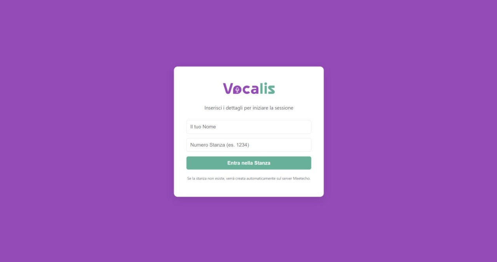
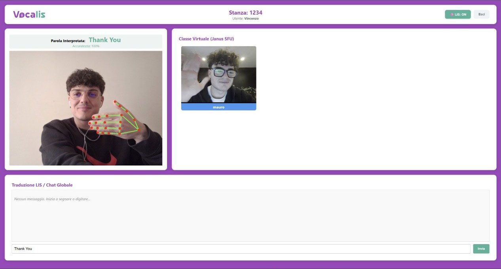
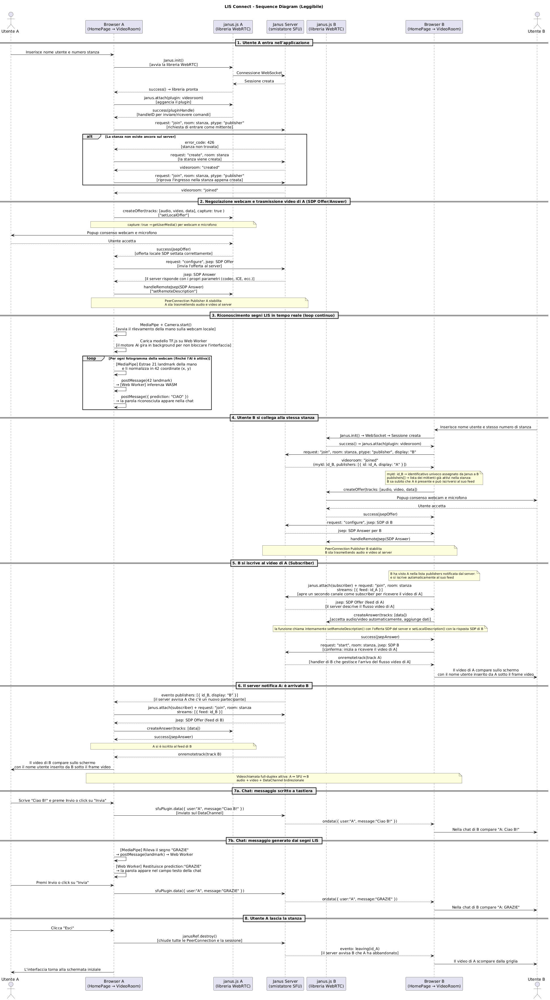

# VocaLIS - Real-time LIS-to-Text Translation App
---

<p align="center">
  
</p>


VocaLIS è un'applicazione web che permette la videochiamata tra utenti e la traduzione in tempo reale della Lingua dei Segni (LIS) in testo. L'applicazione è sviluppata interamente lato client in **React**. Per la gestione delle sessioni WebRTC e lo smistamento dei flussi multimediali l'applicazione fa affidamento sul gateway **Janus**, utilizzato nella sua istanza pubblica di test. Per il riconoscimento dei segni vengono utilizzato motori **WASM** di **TensorFlow.js**.

---
1. [**Caratteristiche Principali**](#caratteristiche-principali)
2. [**Interfaccia dell'app**](#interfaccia-dellapp)
3. [**Tecnologie Utilizzate**](#tecnologie-utilizzate)
4. [**Setup del Progetto**](#setup-del-progetto)
5. [**Outline del Progetto**](#outline-del-progetto)
6. [**Struttura dell'Applicazione**](#struttura-dellapplicazione)
7. [**Sequence Diagram**](#sequence-diagram)
8. [**Autori**](#autori)

---

## Caratteristiche principali
- Videoconferenza in tempo reale tra più utenti tramite architettura SFU (Selective Forwarding Unit) con Janus Gateway
- Chat multi-utente in tempo reale tramite DataChannel WebRTC
- Traduzione in tempo reale della Lingua dei Segni (LIS) in testo tramite TensorFlow.js e WebAssembly
- Interfaccia utente moderna e reattiva sviluppata in React

---

## Interfaccia dell'app

### Schermata principale

<div style="display: flex; gap: 10px;">
  
</div>

### Videochiamata

<div style="display: flex; gap: 10px;">
  
</div>

---

## Modalità di utilizzo
### Video Tutorial
<div style="display: flex; gap: 10px;">
  <video src="lis-app/public/assets/DA AGGIUNGERE" width="100%" controls></video>
</div>

---

## Tecnologie Utilizzate

- **React** : Libreria JavaScript per costruire interfacce utente. Gestisce il rendering dei componenti, lo stato dell'applicazione e il ciclo di vita della videochiamata.
- **WebRTC** : Standard web per la comunicazione audio/video in tempo reale tra browser, con annesso DataChannel per la chat. Gestisce la negoziazione SDP (Offer/Answer), lo scambio ICE e la cifratura DTLS dei flussi media.
- **Janus Gateway** : WebRTC server open-source sviluppato da Meetecho. Riceve i flussi video dai publisher e li instrada verso i subscriber con architettura SFU (Selective Forwarding Unit).
- **MediaPipe Hands** : Libreria di Google per il rilevamento in tempo reale della mano tramite webcam. Estrae 21 keypoint 3D per ogni frame e li normalizza geometricamente per renderli invarianti alla posizione della mano nell'inquadratura.
- **TensorFlow.js** : Libreria di Machine Learning per JavaScript. Esegue l'inferenza del modello di classificazione dei segni LIS direttamente nel browser, senza inviare dati a server esterni.
- **WebAssembly (WASM)** : Formato binario ad alte prestazioni eseguibile nel browser. Usato come backend di TensorFlow.js (con supporto SIMD) per accelerare l'inferenza del modello rispetto al backend JavaScript puro.
- **HTML5** : Linguaggio di markup utilizzato per definire la struttura dell'interfaccia utente.
- **CSS** : Linguaggio di stile utilizzato per definire l'aspetto visivo dell'interfaccia utente.

---

# Setup del progetto

Per avviare il progetto, segui questi passaggi:

### 1. **Clone della repository**
```
git clone https://github.com/WebRTC-Projects-Unina/VideoRoom_Janus_LIS
```

### 2. **Installare le Dipendenze**
 
Accedi alla cartella "lis-app" e installa le dipendenze necessarie utilizzando **npm**
```
cd VideoRoom_Janus_LIS/lis-app
npm install
```

### 3. **Avviare il Server di Sviluppo**

Avvia il server di sviluppo con il comando:
```
npm start
```

### 4. **Aprire l'Applicazione**

Apri il browser e vai all'indirizzo: http://localhost:3000

---

# Outline del Progetto
La struttura del progetto VocaLIS è organizzata in due cartelle principali: `lis-app`.
```
/VideoRoom_Janus_LIS
  /lis-app                          
    /public
      /assets
        vocalis-logo.png            
        segni.png                   
      /tfjs_sign2text_model
        model.json                  
        group1-shard1of1.bin        
      sign2text_classes.json        
      index.html
      favicon.ico
      manifest.json
    /src
      /components
        HomePage.js                 
        VideoRoom.js                
        LocalVideo.js               
        RemoteVideoGrid.js          
        ChatBox.js                  
      /styles
        App.css
        index.css
      /workers
        inferenceWorker.js          
      App.js
      index.js
    config-overrides.js             
    package.json    
```

# Struttura dell'Applicazione
L'applicazione è sviluppata come una Single Page Application (SPA) in React. La logica di routing e gestione dello stato globale della sessione è centralizzata in `App.js`.

## Componenti principali

### `App.js`
Funge da entry-point dinamico. Mantiene lo stato della connessione corrente (`sessionData`) che contiene il nome dell'utente e l'ID della stanza.
- **Se `sessionData` è vuoto:** renderizza il componente `HomePage`.
- **Se `sessionData` è popolato:** renderizza il componente `VideoRoom`, passandogli i dati di sessione come `props`.

### `HomePage.js`
Questo componente rappresenta il primo entry-point per l'utente (Landing Page). A differenza di un form tradizionale che ricarica la pagina, `HomePage.js` è un componente che implementa una form dentro la quale vengono inseriti i dati per la sessione (nome utente e ID stanza).

Il componente si appoggia ad un hook `useState` per tracciare i dati in tempo reale, mantenendo due token fondamentali:
- **`username`:** L'identificativo del client, che verrà poi allegato al feed remoto e iniettato nei payload della ChatBox P2P.
- **`room`:** L'identificativo numerico della stanza virtuale da interrogare nativamente sul Gateway Janus.

```javascript
export default function HomePage({ onJoin }) {
    const [username, setUsername] = useState('');
    const [room, setRoom] = useState('');
    // ...
```

**Validazione e Sollevamento dello Stato (State Lifting):**
Quando inviamo la richiesta triggera una funzione di controllo che ferma il ricaricamento del browser (`e.preventDefault()`). Subito dopo, viene fatta una validazione client-side per assicurarsi che i campi siano valorizzati.

Se i dati sono validi, l'ID della stanza viene convertito in numero intero (mandatorio affinché le API del plugin VideoRoom di Janus accettino il comando) e veicolato verso l'alto (al padre `App.js`) sfruttando la prop / callback `onJoin`:

```javascript
    const handleSubmit = (e) => {
        e.preventDefault();
        if (username && room) {
            onJoin({ username, room: parseInt(room) });
        } else {
            alert("Per favore, inserisci sia il nome che il numero della stanza.");
        }
    };
```
In questo modo alteriamo l'oggetto genitore `sessionData` in `App.js`. Come risultato React effettua il demount del componente `HomePage` e carica al suo posto il componente `VideoRoom.js`, istanziandolo i parametri appena raccolti.

### `VideoRoom.js`
Questo componente orchestra sia la UI della stanza che la comunicazione di rete, agendo come client per il server WebRTC Janus.

`VideoRoom` riceve `username` e `roomID` da `HomePage` e li conserva tramite `useRef` per renderli accessibili all'interno dei callback asincroni di Janus senza causare re-render indesiderati.

**Struttura UI Interna:**
*   `<LocalVideo>`: Gestisce la webcam e l'elaborazione AI locale tramite Web Worker (con toggle per il traduttore LIS).
*   `<RemoteVideoGrid>`: Renderizza dinamicamente i `MediaStream` (audio/video) ricevuti dagli altri partecipanti.
*   `<ChatBox>`: Visualizza la chat multi-utente trasmessa in P2P tramite DataChannel.

**Gestione della sessione Janus:**
Il componente gestisce l'intero ciclo di vita della sessione Janus: si connette al server tramite WebSocket, si registra come Publisher (trasmettendo audio, video e DataChannel), e sottoscrive dinamicamente i feed degli altri partecipanti come Subscriber. Espone inoltre un bottone "Esci" che chiama `janusRef.current.destroy()`, deallocando tutte le PeerConnection prima di riportare l'utente alla `HomePage`.

Per i dettagli sul flusso Publisher/Subscriber e la negoziazione SDP, rimandiamo alla sezione [Architettura di Rete](#architettura-di-rete-janus-webrtc-server).

### `LocalVideo.js`
Questo componente rappresenta gli "occhi" dell'applicazione, con il solo scopo di acquisire il flusso video locale (Webcam) e di elaborarlo per estrarre i *landmark* tridimensionali necessari per l'Inferenza LIS, i quali sono poi inoltrati al componente `inferenceWorker.js` che gira in un thread separato per non bloccare il rendering dell'interfaccia.

**Inizializzazione di MediaPipe:**
Il componente sfrutta le API di `@mediapipe/hands` e `@mediapipe/camera_utils`. Al mount iniziale il motore MediaPipe viene istanziato e salvato a livello globale (`window.globalHandsInstance`) in modo da sopravvivere intatto anche ai re-render frequenti o i Fast Refresh causati da React, evitando perdite di dati.

```javascript
const initializeMediaPipe = () => {
  if (!window.globalHandsInstance) {
    window.globalHandsInstance = new Hands({
      locateFile: (file) => `https://cdn.jsdelivr.net/npm/@mediapipe/hands@0.4.1675469240/${file}`
    });
    window.globalHandsInstance.setOptions({
      maxNumHands: 1, modelComplexity: 1, minDetectionConfidence: 0.5, minTrackingConfidence: 0.5
    });
  }
  window.globalHandsInstance.onResults(onResults);

  startWebcam(window.globalHandsInstance);
};
```

**Estrazione, Normalizzazione Geometrica e Overlay Visivo**
Ogni volta che MediaPipe individua lo scheletro della mano in un frame, evoca la callback di rendering `onResults`. Qui `LocalVideo.js` svolge tre compiti in maniera sequenziale gestendo l'elemento video e il canvas che lo ricopre:
1. **Painting Grafico:** Usa le funzioni `drawing_utils` di MediaPipe per disegnare lo scheletro della mano. 
2. **Estrazione e Normalizzazione:** Preleva l'array dei 21 punti grezzi passati da MediaPipe. Scorre tutto, estrae la X e la Y calcolando matematicamente le coordinate minime. Subito dopo "sottrae" a tutti i landmark proprio quel minimo locale. Questo calcolo di *Normalizzazione Geometrica* garantisce che una vocale tracciata dal modello AI risulti strutturalmente identica a prescindere se l'utente ponga la mano in alto a sinistra o in centro. L'algoritmo restringe l'uscita da coordinate globali ad un flat-array finale composto ordinatamente da 42 float.
3. **Collaborazione col Web Worker:** Terminato il calcolo dello scheletro, i dati vengono inviati all'`inferenceWorker.js` nel backend Javascript separato, scaricando tutto il peso della Rete Neurale Tensor fuori dalla vista di React. Questo accade per ogni frame catturato, fintanto che non viene disabilitata l'AI tramite l'apposito interruttore posto in interfaccia.

Questo permette di separare il rendering della pagina dai pesanti calcoli della rete neurale.

### `RemoteVideoGrid.js`
Questo componente è incaricato di visualizzare tutti i partecipanti connessi alla stanza in qualità di *Subscriber*. Poiché i peer possono entrare e uscire in qualsiasi momento asincrono, la griglia video non è un layout statico ma puramente reattivo.

**Mapping delle stream remote:**
Il componente riceve in ingresso la prop `remoteStreams` da `VideoRoom.js`. Si tratta di un oggetto di stato le cui chiavi sono gli identificativi numerici generati da Janus e i valori sono **oggetti** con due campi:
- `stream`: l'istanza `MediaStream` con i track audio/video del partecipante
- `display`: il nome utente scelto dal partecipante nella `HomePage`

Sfruttando `Object.entries()`, il componente trasforma questa mappa in un array renderizzabile:

```javascript
export default function RemoteVideoGrid({ remoteStreams }) {
  const streamEntries = Object.entries(remoteStreams || {});

  return (
    <div style={{ display: 'flex', flexWrap: 'wrap', gap: '10px' }}>
      {streamEntries.map(([id, entry]) => (
        <RemoteVideoPlayer key={id} id={id} stream={entry.stream} display={entry.display} />
      ))}
    </div>
  );
}
```

**Il Sottocomponente Singolo (`RemoteVideoPlayer`):**
L'utilizzo di questo componente è dovuto al fatto che l'attributo `srcObject` del tag HTML5 `<video>` non è una *prop* serializzabile, ma richiede un'assegnazione imperativa al nodo DOM.
Esso riceve come prop lo stream video, il nome utente e l'identificativo associato e lo assegna all'elemento <video> tramite useRef. In questo modo manteniamo il riferimento all'elemento HTML che contiene la stream video, in modo da poterlo riassegnare ogni volta che cambia la stream.

```javascript
function RemoteVideoPlayer({ stream, display, id }) {
  const videoRef = useRef(null);

  useEffect(() => {
    if (videoRef.current && stream) {
      videoRef.current.srcObject = stream;
    }
  }, [stream]);

  return (
    <div>
      <video ref={videoRef} autoPlay playsInline />
      <div>{display || `Utente ${id}`}</div>
    </div>
  );
}
```
Questo garantisce che solo la cella dell'utente coinvolto venga ri-renderizzata quando cambia un track, senza ricaricare i video degli altri partecipanti.

### `ChatBox.js`
Questo componente gestisce la chat multi-utente trasmessa in P2P tramite DataChannel. In questo contesto, `ChatBox.js` funge non solo da UI testuale, ma da vero e proprio **Buffer Accumulatore** per il flusso costante di stringhe tradotte dall'Intelligenza Artificiale.

**L'Accumulatore Reattivo (`useEffect`):**
Invece di inviare i messaggi frammentati o ripetitivi in rete (spammando la chat comune), il componente deposita temporaneamente le traduzioni nello stato locale `draftMessage`. In ascolto sugli aggiornamenti della prop `currentSign`, l'hook `useEffect` fa da debouncer:
aggancia l'ultima predizione scartando i duplicati immediati (appoggiandosi alla cache sincrona `lastProcessedRef.current`) e concatena i risultati nel campo di testo. Implementa inoltre una logica di formattazione che valuta se apporre uno spazio (in caso di parole intere riconosciute) o fondere la stringa nel caso si stia scrivendo una parola lettera per lettera:

```javascript
  useEffect(() => {
    if (currentSign && currentSign !== lastProcessedRef.current) {
      lastProcessedRef.current = currentSign; 

      setDraftMessage(prev => {
        const spacer = (currentSign.length > 1 && prev.length > 0) ? " " : "";
        return prev + spacer + currentSign;
      });
    } else if (!currentSign) {
      lastProcessedRef.current = ""; 
    }
  }, [currentSign]);
```
L'utente ha due opzioni senza soluzione di continuità:
1. Lasciar scorrere l'intera frase in LIS inquadrando le mani e avallarla alla fine col bottone Invia.
2. Contaminare l'input: la traduzione IA può essere bloccata o corretta sul momento digitando manualmente tramite tastiera per raffinare il contesto grammaticale del messaggio.

Alla pressione del tasto Invia (o del bottone *Enter* catturato via `handleKeyDown`), l'accumulatore viene svuotato e la stringa stringa validata "risale" (`State Lifting`) fino a `VideoRoom.js` richiamando la prop `onSendMessage(draftMessage)`.
Qui la logica di topologia SFU riprende il controllo: la stringa viene confezionata in un payload JSON pulito (`{"user": "Alice", "message": "Ciao a tutti"}`) ed inviata a tutti i *Subscriber* sfruttando la chiamata nativa `sfuPluginRef.current.data({ text: json_payload })`.

## Architettura di Rete: Janus WebRTC Server

Il progetto implementa una topologia "a stella" sfruttando Janus come **Selective Forwarding Unit (SFU)**.

In un'architettura SFU:
- Ogni client (browser) instaura **una singola connessione WebRTC** in upload (Publisher) per inviare i propri flussi (Webcam, Audio, DataChannel Testuale) al Server Janus.
- Il Server Janus agisce da "router multimediale": riceve i flussi da un utente e li inoltra (forwarding) a tutti gli altri membri della stanza.
- Ogni client instaura poi una connessione in download (Subscriber) per ogni altro partecipante attivo da cui desidera ricevere il flusso.

### Il Plugin "VideoRoom"
Per questo progetto è stato scelto il **plugin `janus.plugin.videoroom`**, in quanto espone nativamente le API necessarie per simulare una "Classe Virtuale".

**Inizializzazione e Connessione (Signaling tramite WebSocket):**
Nel file `VideoRoom.js`, l'inizializzazione parte istanziando la libreria ufficiale `janus.js`.
La comunicazione di controllo (Signaling) tra l'app React e il Server Janus (situato su `wss://janus.conf.meetecho.com/ws`) avviene tramite **Secure WebSockets**. Attraverso i WebSocket scambiamo i pacchetti `SDP` (Session Description Protocol) per negoziare i codec audio/video e raccogliamo i candidati `ICE` per oltrepassare eventuali Firewall/NAT.

**Il Flusso "Publisher" (Chi trasmette):**
Al completamento dell'init Janus, il client si attacca al plugin e invia una richiesta `join` configurandosi come `publisher`. Subito dopo chiama `createOffer` usando la sintassi moderna dell'API **`tracks`**:
```javascript
sfuPluginRef.current.createOffer({
  tracks: [
    { type: 'audio', capture: true, recv: false },
    { type: 'video', capture: true, recv: false },
    { type: 'data' }
  ],
  success: function(jsepOffer) {
    sfuPluginRef.current.send({ message: { request: "configure" }, jsep: jsepOffer });
  }
});
```
> **Nota:** La vecchia sintassi `media: { audioSend: true, videoSend: true, data: true }` è ancora compatibile ma **deprecata** dalla documentazione Meetecho. La sintassi con `tracks` è quella raccomandata per le versioni correnti di Janus.

Se la telecamera non è disponibile, il codice usa un fallback **"Solo Dati"** specificando solo `{ type: 'data' }` nell'array `tracks`: la Chat P2P funziona comunque anche senza stream video/audio.

**I Flussi "Subscriber" (L'Ascolto):**
Quando Janus notifica la stanza che un nuovo utente è attivo (evento `publishers`), l'app React chiama `newRemoteFeed()`. Questa funzione lancia una nuova istanza del plugin `videoroom` come **subscriber**, usando la sintassi moderna con l'array `streams`:
```javascript
const subscribe = {
  request: "join",
  ptype: "subscriber",
  streams: [{ feed: publisherId }]
};
remoteFeed.send({ message: subscribe });
```
Janus risponde con un JSEP SDP offer. Il client risponde con un `createAnswer`, specificando solo `{ type: 'data' }`: i track audio e video remoti vengono **accettati automaticamente**.

**Gestione dei Track Remoti e delle Uscite:**
La callback `onremotetrack` viene invocata per ogni singolo `MediaStreamTrack` ricevuto. Ogni track viene aggiunto ad un `MediaStream` associato all'ID del publisher; il nome utente (`display`), trasmesso da Janus nell'evento `publishers`, viene memorizzato insieme allo stream nello stato `remoteStreams` come oggetto `{ stream, display }`. Questa struttura permette a `RemoteVideoGrid` di mostrare il nome scelto dall'utente nella `HomePage` direttamente sotto il suo video.
Quando un publisher lascia la stanza (evento `msg["leaving"]`), il client reagisce eliminando immediatamente l'entry di quell'utente dalla griglia React.

## Intelligenza Artificiale e WebAssembly (WASM) per l'Inferenza LIS
Per disaccoppiare e accelerare l'elaborazione dell'Intelligenza Artificiale dall'UI React è stata utilizzata un'architettura basata su **WebAssembly (WASM)** e **Web Workers**.

### 4.1. Il Problema del Main Thread
Nativamente, le applicazioni web Javascript girano su un singolo thread (il *Main Thread*). Quando si introduce un motore di Machine Learning in tempo reale (come TensorFlow.js) per l'analisi dei fotogrammi video, i pesanti calcoli matriciali bloccano il thread. Questo genera rallentamenti, ritardi nel rendering e un'interfaccia utente che non risponde ai comandi.

### 4.2. Web Workers (Isolamento del Processo)
Per risolvere questo problema, tutta la logica di TensorFlow è stata estratta da `LocalVideo.js` e spostata in un **Web Worker** dedicato (`src/workers/inferenceWorker.js`), permettendo di eseguire gli script in background.

**Flusso Dati Asincrono:**
1. React (in `LocalVideo.js` tramite MediaPipe) si limita a estrarre i 42 punti grezzi della mano a partire dal video acquisito tramite `getUserMedia`.
2. I landmark grezzi vengono inviati al Worker usando `postMessage(data)`.
3. Il Main Thread torna subito libero per aggiornare la UI a 60 FPS.
4. Il Worker, nel suo thread isolato, esegue l'inferenza valutando la classe d'appartenenza del gesto senza bloccare la UI.
5. Il Worker applica un "Filtro di Stabilità" (es. 15-50 frame consecutivi) per evitare lo spam di parole e scartare falsi positivi durante i movimenti di transizione.
6. Quando viene riconosciuto e stabilizzato un segno, il Worker rispedisce la stringa pulita all'UI chiamando `postMessage({type: 'PREDICTION_RESULT', prediction})`. `LocalVideo.js` emette la stringa verso la `ChatBox` passando per `VideoRoom`.

### 4.3. TensorFlow.js WASM Backend (Accelerazione CPU)
Per impostazione predefinita, TensorFlow.js cerca di sfruttare la scheda video tramite WebGL. Per reti ottimizzate o ambienti privi di GPU dedicate, il calcolo CPU standard di Javascript risulta lento.
È stato quindi importato **`@tensorflow/tfjs-backend-wasm`**, la libreria ufficiale con i binari XNNPACK pre-compilati in C++ e convertiti in WebAssembly.
Chiamando `tf.setBackend('wasm')` nell'`inferenceWorker`, le operazioni matriciali vengono affidate ai file `.wasm`.

### 4.4. Integrazione nel Bundler (Webpack Override)
Poiché i file `.wasm` sono binari, i bundler come quello di `create-react-app` tendono a ignorarli, causando Error 404.
Per risolvere questa problematica:
- È stato introdotto `react-app-rewired` e `copy-webpack-plugin`.
- È stato definito un file `config-overrides.js` per intercettare i file `tfjs-backend-wasm*.wasm` da `node_modules` e copiarli dinamicamente in `/static/js/` durante la build.
In questo modo il Web Worker ha l'autorizzazione a scaricarli localmente senza venir bloccato.

---

## Sequence Diagram
 
 


---

# Autori

VocaLIS è stato sviluppato da:

- **Mauro Lauritano**
- **Vincenzo Laudiero**
